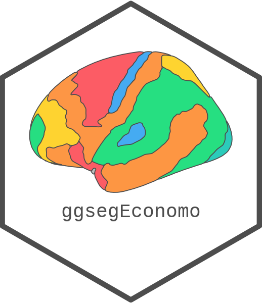
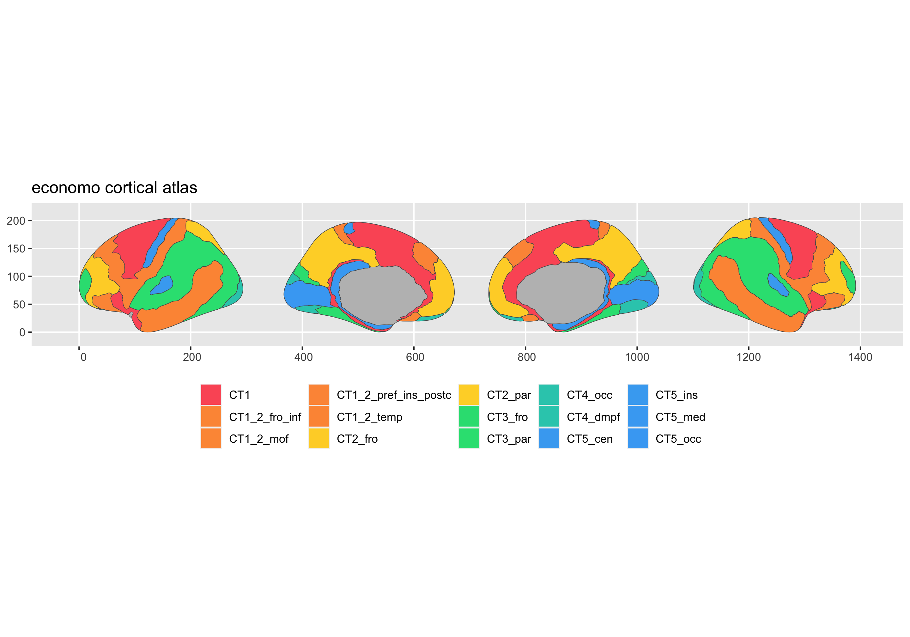
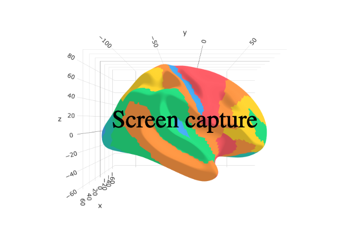

<!-- README.md is generated from README.Rmd. Please edit that file -->

# ggsegEconomo 

<!-- badges: start -->

[](https://github.com/ggseg/ggsegEconomo/actions)
[](https://zenodo.org/badge/latestdoi/425036347)

<!-- badges: end -->

This package contains dataset for plotting the Economo & Koskinas 1925
historical atlas of functional segregation with ggseg and ggseg3d, based
on the supplementary materials of Pijnenburg et al., NeuroImage, 239,
2021 [DOI](https://doi.org/10.1016/j.neuroimage.2021.118274); Version 1;
15-01-2021.

C.F. von Economo, G.N. Koskinas; Die Cytoarchitektonik Der Hirnrinde Des
Erwachsenen Menschen; J. Springer (1925)

To learn how to use these atlases, please look at the documentation for
[ggseg](https://ggseg.github.io/ggseg/) and
[ggseg3d](https://ggseg.github.io/ggseg3d)

## Installation

We recommend installing the ggseg-atlases through the ggseg
[r-universe](https://ggseg.r-universe.dev/ui#builds):

``` r
# Enable this universe
options(repos = c(
    ggseg = 'https://ggseg.r-universe.dev',
    CRAN = 'https://cloud.r-project.org'))

# Install some packages
install.packages('ggsegEconomo')
```

You can install the released version of ggsegEconomo from
[GitHub](https://github.com/) with:

``` r
# install.packages("remotes")
remotes::install_github("ggseg/ggsegEconomo")
```

``` r
library(ggseg)
#> Warning: package 'ggseg' was built under R version 4.1.1
#> Loading required package: ggplot2
library(ggseg3d)
library(ggsegEconomo)

plot(economo) +
  theme(legend.position = "bottom", 
        legend.text = element_text(size = 9)) +
  guides(fill = guide_legend(ncol = 6))
```



``` r
library(dplyr)
ggseg3d(atlas = economo_3d) %>% 
  add_glassbrain() %>% 
  pan_camera("right lateral")
```



Please note that the ‘ggsegEconomo’ project is released with a
[Contributor Code of Conduct](CODE_OF_CONDUCT.md). By contributing to
this project, you agree to abide by its terms.
